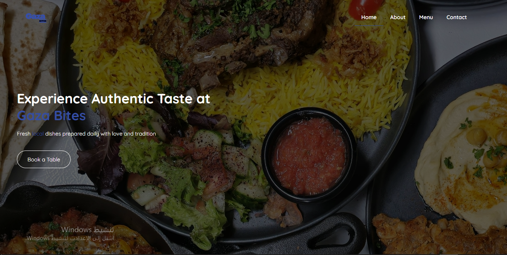

# 🍔 Gaza Bites

A modern restaurant website built using HTML and CSS.

---

## 🚀 Live Demo

👉 https://Soleman-Kamal.github.io/Gaza-Bites/

---

## 📸 Preview



---

## 🛠️ Technologies Used

* HTML
* CSS

---

## 📂 Project Structure

```
Gaza-Bites/
│── index.html
│── style.css
│── image.png
│── img/
```

---

## ⚡ Features

* Responsive design
* Clean UI
* Food menu section
* Modern layout

---

## 📌 How to Run

1. Download the project
2. Open `index.html` in your browser

---

## 👨‍💻 Author

* GitHub: https://github.com/Soleman-Kamal
